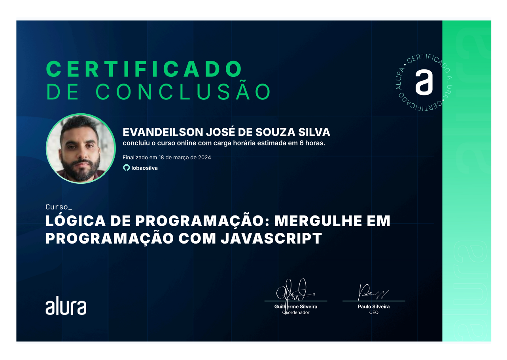
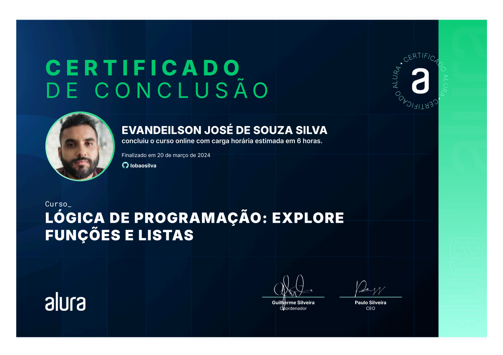
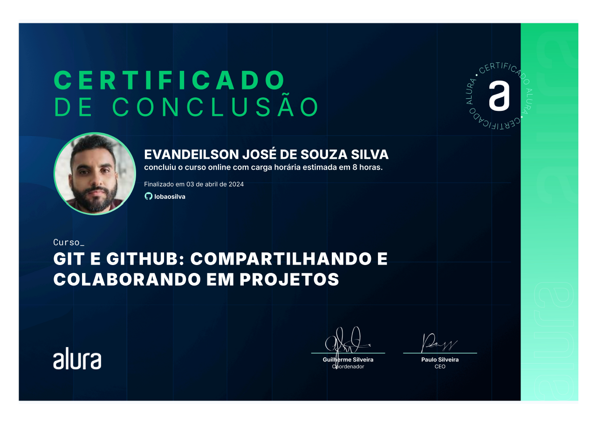
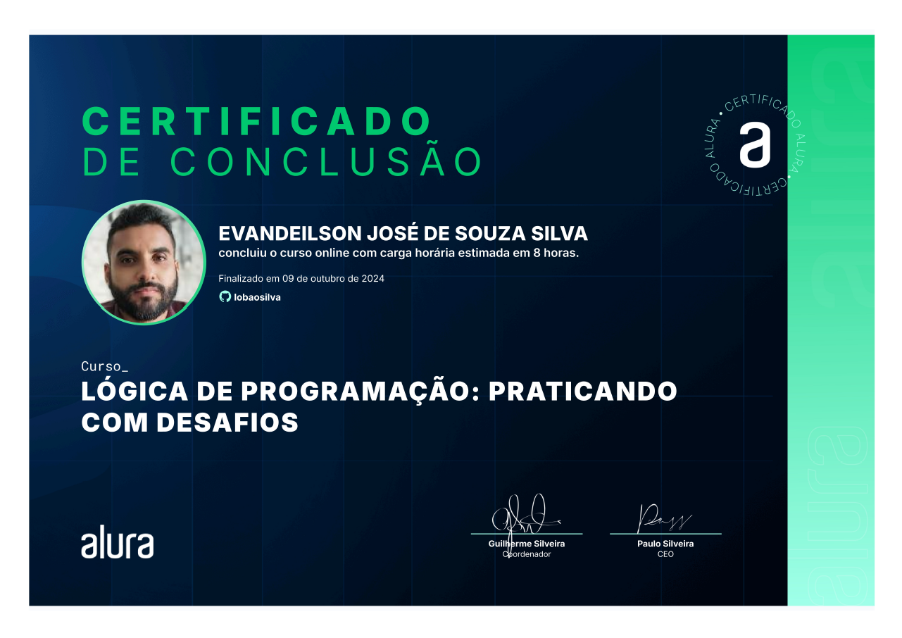
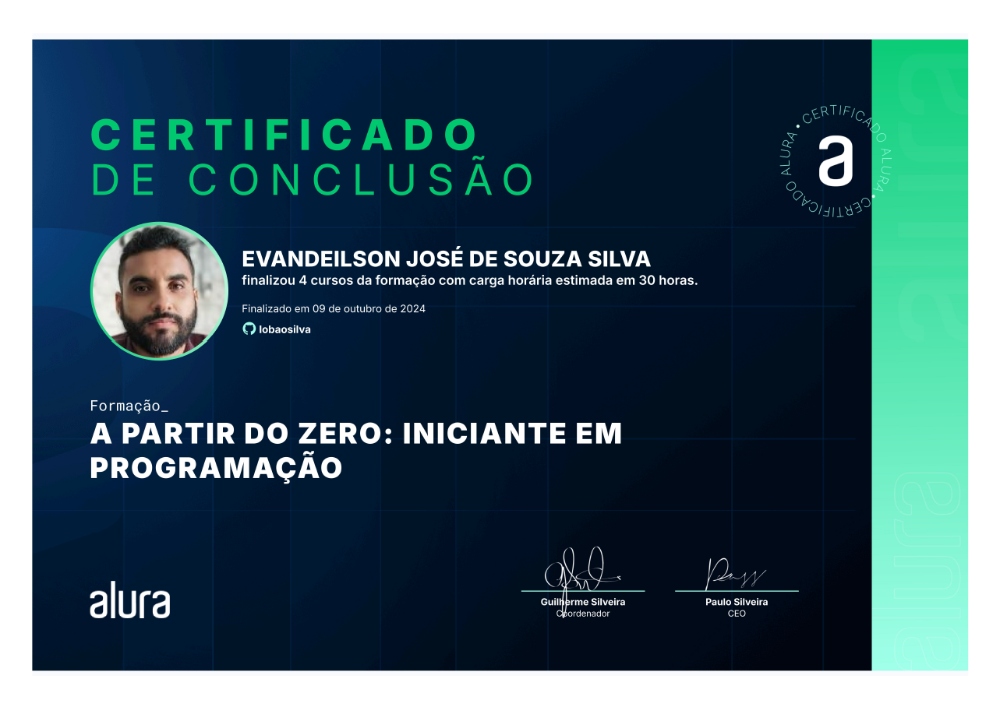
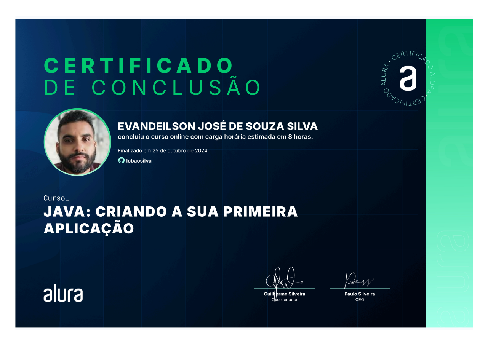

# Desenvolvimento em Java - Trilhas de Estudo Alura

## 🚀 Visão Geral do Projeto

Este repositório contém minha jornada pela formação em **Desenvolvimento Java** na plataforma Alura. O objetivo é construir uma base sólida em programação Java, aprofundar o conhecimento no desenvolvimento web com **Spring Boot** e aplicar boas práticas para desenvolver aplicações escaláveis.

## 🛠️ Tecnologias e Ferramentas
- **Java 17**
- **Spring Boot**
- **RabbitMQ**
- **Apache Kafka**
- **Arquitetura de Microsserviços**

## 📅 Trilhas de Estudo

1. **[A partir do zero: Iniciante em Programação](https://www.alura.com.br/formacao-programacao)**  
   **Status:** ✅ *Concluído*  
   **Descrição:** Introdução à lógica de programação, com foco em conceitos essenciais como variáveis, loops e condicionais.

   - **1.1** Lógica de programação: mergulhe em programação com JavaScript - Concluído ✅
   - **1.2** Lógica de programação: explore funções e listas - Concluído ✅
   - **1.3** Git e GitHub: compartilhando e colaborando em projetos - Concluído ✅
   - **1.4** Lógica de programação: praticando com desafios - Concluído ✅

2. **[Aprenda a Programar em Java com Orientação a Objetos](https://www.alura.com.br/formacao-java)**  
   **Status:** 🟡 *Em Andamento - 25%*  
   **Descrição:** Domínio dos princípios da Programação Orientada a Objetos (POO), como herança, encapsulamento, polimorfismo e abstração.
   
   - **2.1** Java: criando a sua primeira aplicação - Concluído ✅
   - **2.2** Java: aplicando a Orientação a Objetos
   - **2.3** Java: trabalhando com listas e coleções de dados
   - **2.4** Java: consumindo API, gravando arquivos e lidando com erros

3. **[Java Web: Crie Aplicações com Spring Boot](https://www.alura.com.br/formacao-java-web-spring-boot)**  
   **Status:** 🔜 *Próximo*  
   **Descrição:** Aprenda a desenvolver aplicações web usando Spring Boot e construa APIs REST para projetos em nível empresarial.

   - **3.1** Java: trabalhando com lambdas, streams e Spring Framework
   - **3.2** Java: persistência de dados e consultas com Spring Data JPA
   - **3.3** Java: criando sua primeira API e conectando ao front

4. **[Java e Spring Boot](https://www.alura.com.br/formacao-spring-boot-3)**  
   **Status:** 🔜 *Pendente*  
   **Descrição:** Funcionalidades avançadas do Spring Boot, com foco em integração com bancos de dados, segurança e injeção de dependência.

   - **4.1** Spring Boot 3: desenvolva uma API Rest em Java
   - **4.2** Spring Boot 3: aplique boas práticas e proteja uma API Rest
   - **4.3** Spring Boot 3: documente, teste e prepare uma API para o deploy

5. **[Boas Práticas em Java](https://www.alura.com.br/formacao-boas-praticas-java)**  
   **Status:** 🔜 *Pendente*  
   **Descrição:** Explore as melhores práticas no desenvolvimento em Java, incluindo refatoração de código, testes e princípios de código limpo.

   - **5.1** Java e refatoração: melhorando códigos com boas práticas
   - **5.2** Boas práticas de programação: melhore o código de uma API Java
   - **5.3** Boas práticas de programação: automatizando testes com Java

## 🎯 Objetivos

- Dominar a programação Java e seu ecossistema.
- Compreender e implementar projetos reais utilizando **Spring Boot** e arquitetura de **microsserviços**.
- Aplicar as melhores práticas de desenvolvimento de software, focando em escalabilidade, manutenção e código limpo.

## 🌱 Progresso

## 📜 Certificados

Aqui estão os certificados de cursos concluídos durante a formação em Java na Alura:

    
    
    
    
    
    

## 🔗 Recursos e Documentação
- [Formação Alura: Desenvolvimento Java](https://www.alura.com.br/formacao-java)
- [Documentação Oficial do Java](https://docs.oracle.com/en/java/)
- [Documentação do Spring Boot](https://spring.io/projects/spring-boot)

## 📧 Contato
Se você tiver dúvidas ou sugestões, entre em contato comigo pelo [GitHub](https://github.com/lobaosilva).

---

**Autor**: *Lobão Silva*  
*Versão*: 1.0  
